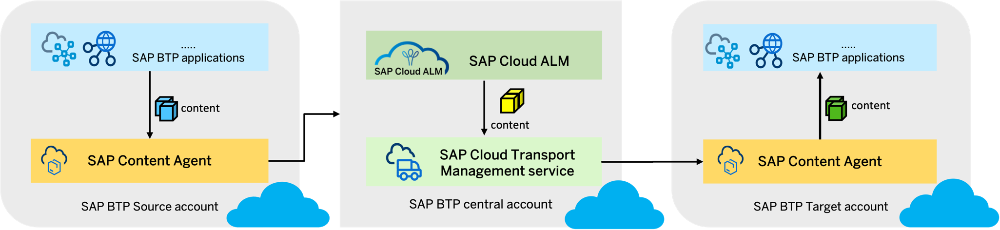

# Session ID - AD261
SAP Teched Hands-On Guide for Content Management using SAP Content Agent service, SAP Cloud Transport Management, and SAP Cloud ALM.

## Description

This repository contains the material for the SAP TechEd 2022 session called **AD261 - Manage the Propagation of Content Types Based on SAP BTP with SAP Cloud ALM**. 

## Overview

Cloud application solutions, for example applications on SAP S/4HANA Cloud, public edition, SAP Cloud Integration, or SAP Workflow Management publish content to the SAP Business Accelerator Hub. Depending on your requirement, you can import, and transport this content across various landscapes. Also, you can assemble different content types and export them. Each service has its own content format to solve specific business or technical problems. 

### Challenges 
1.	Transparency of deployed content
2.	Which version of content 
3.	See the Content Status
4.	Trigger selective transport across accounts
5.	Clone an account / clone a service subscription 
6.	Visualize Content and Application Dependencies 

### Key Capabilities and Benefits 

1.	Simple onboarding, service subscription and one-time setup
2.	Added governance with SAP Cloud ALM and standardized change processes
3.	Provide a separation of concerns with the audit trail of changes with SAP Cloud Transport Management Service 
4.	Better productivity for developers, operators, and supervisors.
5.	Transparency of content transports and control with authorizations
6.	Less manual transport errors

## Requirements

Tools Overview for content transports 
 - SAP Content Agent service - A generic tool for managing content operations for different SAP BTP service. This service is offered free and auto-entitled and operates at sub account level
 - SAP Cloud Transport Management - A tool to manage transports of development artifacts and application-specific content. The service is subscribed centrally per SAP BTP global account to effectively manage cloud landscape for transports.
 - SAP Cloud ALM - An application lifecycle management offering for cloud-centric customers. It provides capabilities for implementation and operations of SAP cloud solutions. This service is also subscribed centrally per SAP BTP global account.

### Personas

1. As a *content operator* you have the knowledge of all solutions and content that exists in your organization.
You are responsible to collect changes across SAP BTP applications via standard channels to ensure smooth deliveries. 
Your tasks are to streamline content changes, create packages for related content and trigger the export process for these changes using SAP Transport Management.
To export content, you use SAP Content Agent service. 
  
2. As a *change manager* you are responsible for keeping application changes up-to-date across all landscapes.
Your tasks include reviewing and approving changes and monitoring the propagation of transport requests into target accounts.
To manage the distribution of changes, you use SAP Cloud Transport Management and SAP Cloud ALM.

## Exercises

- [Getting Started - Prerequisites](exercises/ex0/README.md)
- [Exercise 1 - Create a Feature in SAP Cloud ALM](exercises/ex1/README.md)
- [Exercise 2 - Export Content Using SAP Content Agent Service](exercises/ex2/README.md)
- [Exercise 3 - Deploy to TEST Using the Features App in SAP Cloud ALM](exercises/ex3/README.md)
- [Exercise 4 - Deploy to Production Using SAP Cloud Transport Management](exercises/ex4/README.md)
- [Exercise 5 - Confirm Production Deployment](exercises/ex5/README.md)  

## Contributing
Please read the [CONTRIBUTING.md](./CONTRIBUTING.md) to understand the contribution guidelines.

## Code of Conduct
Please read the [SAP Open Source Code of Conduct](https://github.com/SAP-samples/.github/blob/main/CODE_OF_CONDUCT.md).

## How to obtain support

Support for the content in this repository is available during the actual time of the online session for which this content has been designed. Otherwise, you may request support via the [Issues](../../issues) tab.

## License
Copyright (c) 2023 SAP SE or an SAP affiliate company. All rights reserved. This project is licensed under the Apache Software License, version 2.0 except as noted otherwise in the [LICENSE](LICENSES/Apache-2.0.txt) file.
