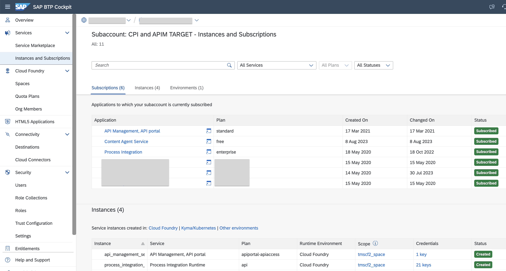
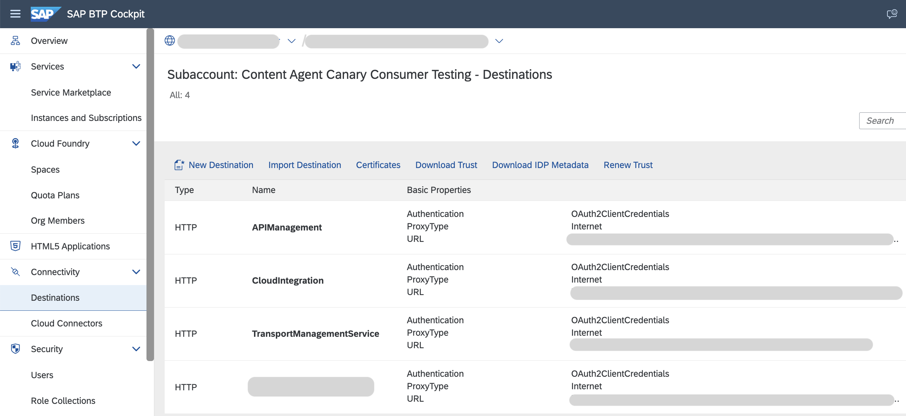
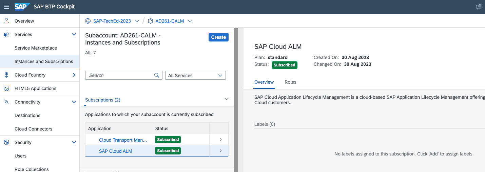
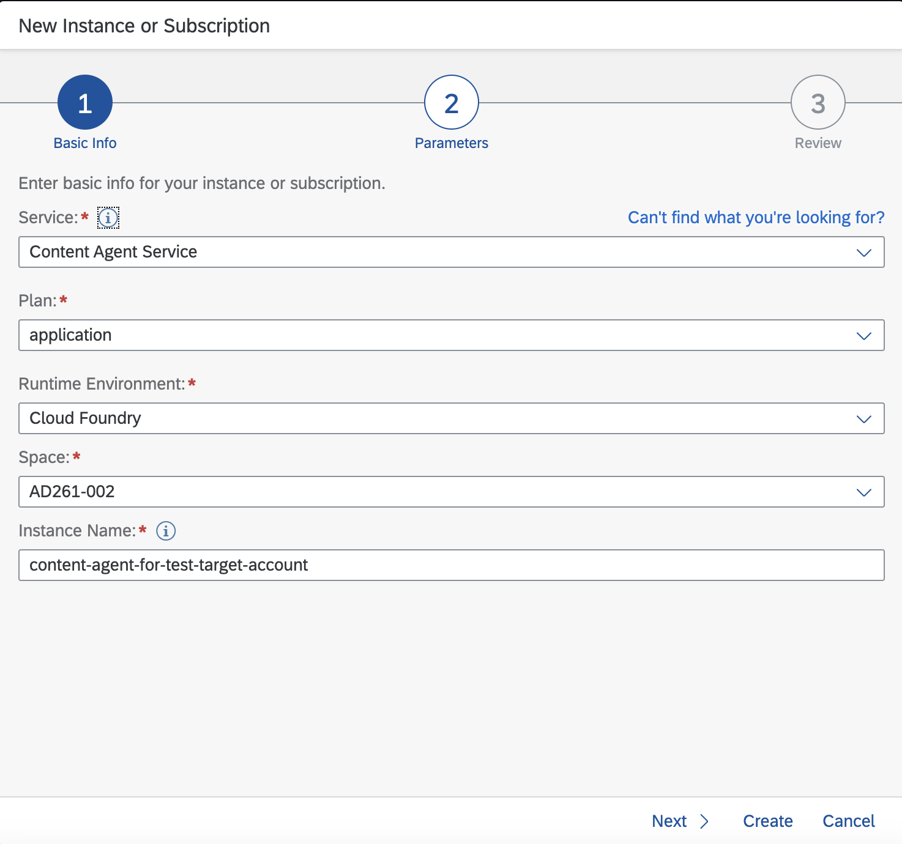
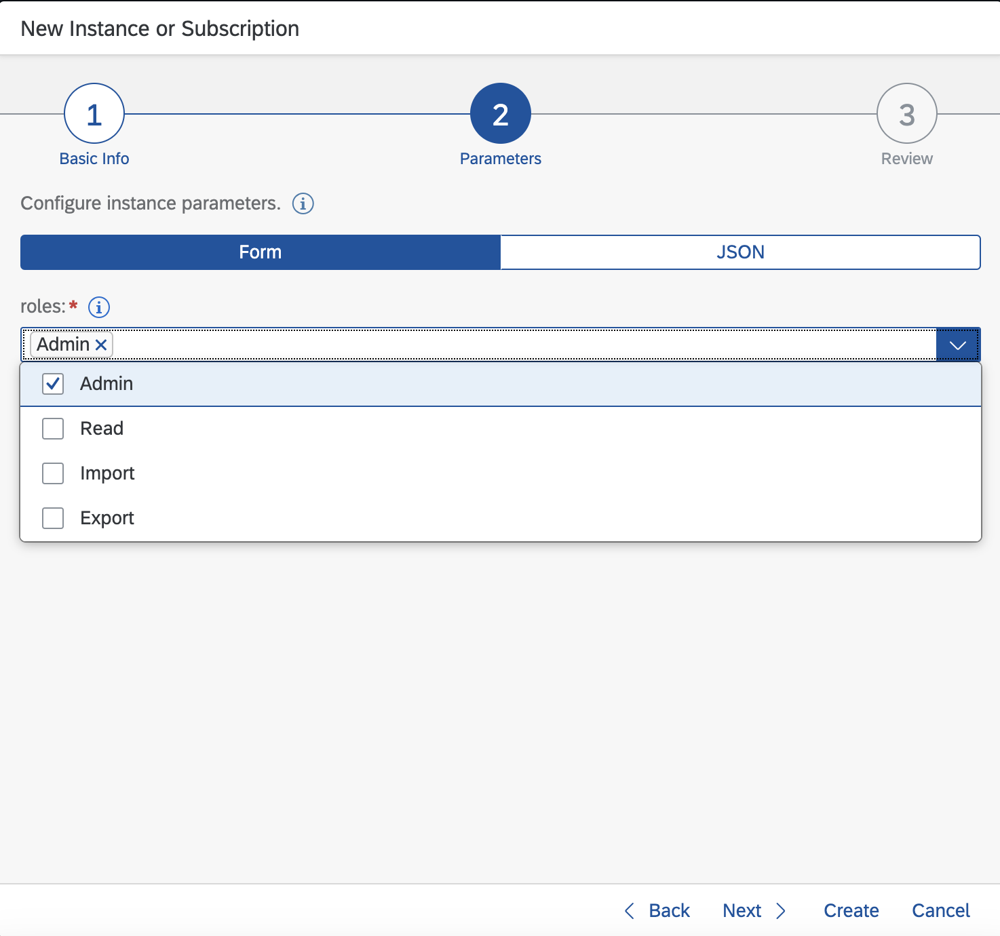
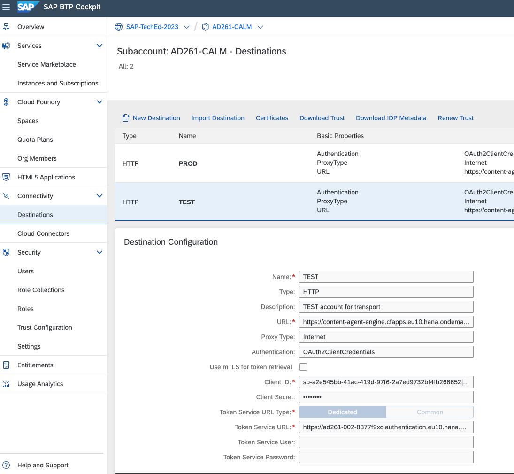
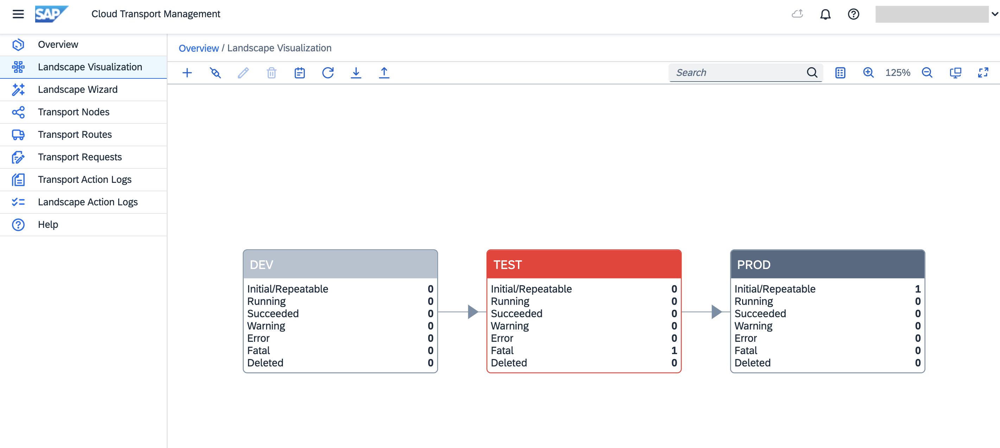
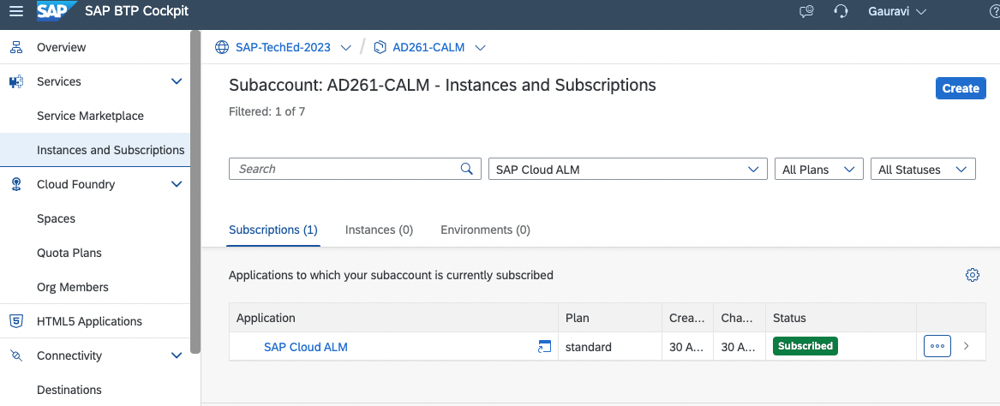
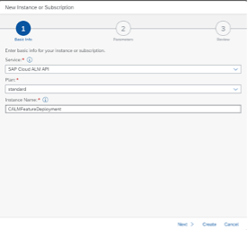

# Getting Started - Prerequisites

In this exercise, you can go through the steps required to set up the SAP BTP accounts and related configurations to get started with transporting content using the recommended tools.
  These steps have been already performed for you. It is for your information only. You could observe the same by going to the SAP BTP sub accounts.

## Create SAP BTP subaccounts 

1. Create subaccounts based on three tier landscape.  
DEV  [AD261-001](https://emea.cockpit.btp.cloud.sap/cockpit/#/globalaccount/e2a835b0-3011-4c79-818a-d7767c4627cd/subaccount/6fd4e2f0-4751-4c32-a2c7-1f1591d4847e/subaccountoverview)
,TEST [AD261-002](https://emea.cockpit.btp.cloud.sap/cockpit/#/globalaccount/e2a835b0-3011-4c79-818a-d7767c4627cd/subaccount/c906b09b-513a-4f8b-987e-68bfb5ac1d29/subaccountoverview)
and PROD [AD261-003](https://emea.cockpit.btp.cloud.sap/cockpit/#/globalaccount/e2a835b0-3011-4c79-818a-d7767c4627cd/subaccount/0da621fb-0270-4b8d-bd8c-deee9a443ec2/subaccountoverview) 

2. In each of these subaccounts create entitlement and subscribe to the following services. 
	<ul>
	  <li>Process Integration application plan "enterprise" </li>
	  <li>Process Integration Runtime service plan "it-rt" </li>
	  <li>API Management, API portal application plan "standard" </li>
	  <li>API Management, API portal service plan "apiportal-apiaccess" </li>
	  <li>Content Agent application plan "free" </li>
	</ul>
 

3. Assign the required roles to required users. 
 To use SAP Content Agent service you need "Content Agent Admin" role collection assigned to your user.
 To use Integration suite you need "PI_Administrator" role collection assigned to your user.
 To use SAP API Management you need "APIPortal.Administrator" role collection assigned to your user.

<Provide list of roles to be assigned>

## Create Subaccount Destinations
1. Create Subaccount Destinations in all three accounts in DEV [AD261-001](https://emea.cockpit.btp.cloud.sap/cockpit/#/globalaccount/e2a835b0-3011-4c79-818a-d7767c4627cd/subaccount/6fd4e2f0-4751-4c32-a2c7-1f1591d4847e/subaccountoverview),TEST [AD261-002](https://emea.cockpit.btp.cloud.sap/cockpit/#/globalaccount/e2a835b0-3011-4c79-818a-d7767c4627cd/subaccount/c906b09b-513a-4f8b-987e-68bfb5ac1d29/subaccountoverview)
and PROD [AD261-003](https://emea.cockpit.btp.cloud.sap/cockpit/#/globalaccount/e2a835b0-3011-4c79-818a-d7767c4627cd/subaccount/0da621fb-0270-4b8d-bd8c-deee9a443ec2/subaccountoverview).
 
2. To create CloudIntegration Destination, use the service key created for Process Integration Runtime service plan "it-rt". 
3. To create APIManagement Destination, use the service key created for API Management, API portal service plan "apiportal-apiaccess"

## Create Central SAP BTP account
1. Create a central SAP BTP subaccount [AD261-CALM](https://emea.cockpit.btp.cloud.sap/cockpit/#/globalaccount/e2a835b0-3011-4c79-818a-d7767c4627cd/subaccount/291cb5e2-bda7-4b89-bd75-d5ff4fd9df3b)
2. Create subscription for Cloud Transport Management service and assign required roles. 
To use Cloud Transport Management service you need "Administrator" role collection assigned to your user.
 
3. Create subscription for Cloud ALM service. To use Cloud ALM you need "Cross Global Administrator" role collection assigned to your user.
 

## Set up landscape in Cloud Transport Management

1. Create service instance and service key of Content Agent “application” plan in  
TEST [AD261-002](https://emea.cockpit.btp.cloud.sap/cockpit/#/globalaccount/e2a835b0-3011-4c79-818a-d7767c4627cd/subaccount/c906b09b-513a-4f8b-987e-68bfb5ac1d29/subaccountoverview)
and PROD [AD261-003](https://emea.cockpit.btp.cloud.sap/cockpit/#/globalaccount/e2a835b0-3011-4c79-818a-d7767c4627cd/subaccount/0da621fb-0270-4b8d-bd8c-deee9a443ec2/subaccountoverview). Select “Admin” role while creating the service instance.
   
   

2. Create Destinations in Central BTP account [AD261-CALM](https://emea.cockpit.btp.cloud.sap/cockpit/#/globalaccount/e2a835b0-3011-4c79-818a-d7767c4627cd/subaccount/291cb5e2-bda7-4b89-bd75-d5ff4fd9df3b) from service instances of Content Agent “application” plan created in above step.
 

3. Create a Transport Landscape in [Cloud Transport Management](https://ad261-calm-h7f2r9xc.ts.cfapps.eu10.hana.ondemand.com/) using transport nodes and target account destinations
 
Source Node
<ul>
  <li>Select the Allow Upload to Node checkbox.</li>
  <li>Leave the Forward Mode set to Auto.</li>
  <li>Do not select the Controlled By SAP Solution Manager checkbox.</li>
  <li>Keep Content Type empty.</li>
</ul>
 
Target Nodes
<ul>
  <li>Do not select the Allow Upload to Node checkbox.</li>
  <li>Leave the Forward Mode set to Auto.</li>
  <li>Select Content Type 'Multi-Target Application' from the dropdown.</li>
  <li>Set the Destination to point to your development subaccount (CPI_TEST_CF).</li>
  <li>Leave the Deployment Strategy set to default.</li>
  <li>Choose OK.</li>
</ul>
 

## Set up Cloud ALM

1. In [AD261-CALM](https://emea.cockpit.btp.cloud.sap/cockpit/#/globalaccount/e2a835b0-3011-4c79-818a-d7767c4627cd/subaccount/291cb5e2-bda7-4b89-bd75-d5ff4fd9df3b) Subscribe to Cloud ALM application using standard plan and assign the required roles.

2. Create service instance and service key for SAP Cloud ALM API and standard plan.
When creating a service instance for feature deployment, the following configuration in json format is needed in order to assign the required scopes to the service instance. 
Paste the following json code into the text editor Replace <YourInstanceName> with your actual instance name. Then Create Service Key.

> 
	{
	    "xs-security": {
	        "xsappname": "<Your Instance Name>",
	        "authorities": [
				"$XSMASTERAPPNAME.imp-cdm-feature-display-ui",
				"$XSMASTERAPPNAME.imp-cdm-feature-manage-ui"
	        ]
	    }
	}

## Configure Transport Management Destinations in Source BTP Account 
Create a SAP BTP destination for Cloud Transport management service in DEV subaccount [AD261-001](https://emea.cockpit.btp.cloud.sap/cockpit/#/globalaccount/e2a835b0-3011-4c79-818a-d7767c4627cd/subaccount/6fd4e2f0-4751-4c32-a2c7-1f1591d4847e/subaccountoverview) using the Cloud ALM API service instance created before. 
<ol>
  <li>Name TransportManagementService (this value is case-sensitive) </li>
  <li>Type	HTTP </li>
  <li>Description You can provide a description for your reference.</li>
  <li>URL	Enter the URL (“Api”) of the service key of your SAP Cloud ALM API instance and append /imp-cdm-transport-management-api/v1. That follows a pattern like this: https://eu10.alm.cloud.sap/api/imp-cdm-transport-management-api/v1</li>
  <li>Proxy Type	Internet </li>
  <li>Authentication OAuth2ClientCredentials</li>
  <li>Client ID clientid from the service key of your SAP Cloud ALM API instance.</li>
  <li>Client Secret clientsecret from the service key of your SAP Cloud ALM API instance.</li>
  <li>Token Service URL Enter the value of url (uaa section) from the service key of your SAP Cloud ALM API instance. Append /oauth/token at the end of URL fetched from the service key.</li>
  <li>Additional Properties Choose New Property. Enter sourceSystemId (this value is case-sensitive) as the key and provide a value of your choice. Reuse the same value as the name of the source transport node in a later step.</li>
</ol>

## Summary

Now that you have successfully configured the BTP Landscape.
Continue to - [Exercise 1 Create SAP Cloud ALM Feature](../ex1/README.md)
