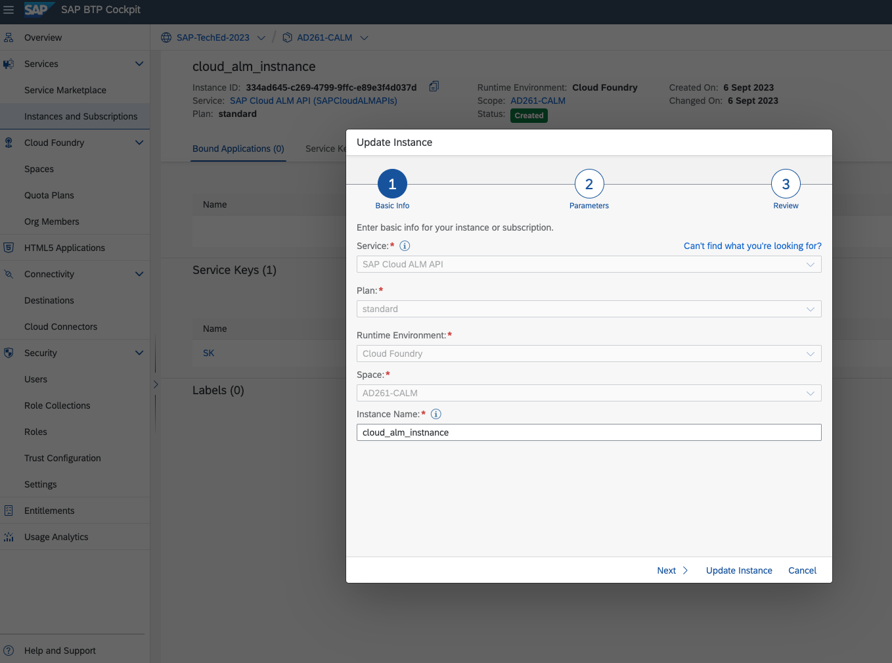

# Getting Started - Prerequisites

You can go through the steps required to set up the SAP BTP accounts and related configurations to start transporting content using the recommended tools.  
These steps have been already performed for you. It is for your information only. You could observe the same by going to the SAP BTP subaccounts.

## Create SAP BTP Subaccounts 

1. Create subaccounts based on the following three-tier landscape.  
DEV  [AD261-001](https://emea.cockpit.btp.cloud.sap/cockpit/#/globalaccount/e2a835b0-3011-4c79-818a-d7767c4627cd/subaccount/6fd4e2f0-4751-4c32-a2c7-1f1591d4847e/subaccountoverview)
, TEST [AD261-002](https://emea.cockpit.btp.cloud.sap/cockpit/#/globalaccount/e2a835b0-3011-4c79-818a-d7767c4627cd/subaccount/c906b09b-513a-4f8b-987e-68bfb5ac1d29/subaccountoverview), and PROD [AD261-003](https://emea.cockpit.btp.cloud.sap/cockpit/#/globalaccount/e2a835b0-3011-4c79-818a-d7767c4627cd/subaccount/0da621fb-0270-4b8d-bd8c-deee9a443ec2/subaccountoverview) 

2. In each of these subaccounts, create entitlements, and subscribe to the following services: 
    * Process Integration - application plan `enterprise`
    * Process Integration runtime - service plan `it-rt`
    * API Management, API portal - application plan `standard`
    * API Management, API portal - service plan `apiportal-apiaccess`
    * Content Agent - application plan `free` 
      
    

3. Assign the required roles to required users.  
  To use SAP Content Agent service, you need the `Content Agent Admin` role collection assigned to your user.  
  To use Integration suite, you need the `PI_Administrator` role collection assigned to your user.  
  To use SAP API Management, you need the `APIPortal.Administrator` role collection assigned to your user.

<Provide list of roles to be assigned>

## Create Subaccount Destinations
1. Create subaccount destinations in all three accounts.  
DEV [AD261-001](https://emea.cockpit.btp.cloud.sap/cockpit/#/globalaccount/e2a835b0-3011-4c79-818a-d7767c4627cd/subaccount/6fd4e2f0-4751-4c32-a2c7-1f1591d4847e/subaccountoverview), TEST [AD261-002](https://emea.cockpit.btp.cloud.sap/cockpit/#/globalaccount/e2a835b0-3011-4c79-818a-d7767c4627cd/subaccount/c906b09b-513a-4f8b-987e-68bfb5ac1d29/subaccountoverview), and PROD [AD261-003](https://emea.cockpit.btp.cloud.sap/cockpit/#/globalaccount/e2a835b0-3011-4c79-818a-d7767c4627cd/subaccount/0da621fb-0270-4b8d-bd8c-deee9a443ec2/subaccountoverview)  
    
3. To create the `CloudIntegration` destination, use the service key created for the Process Integration Runtime service plan `it-rt`. 
4. To create the `APIManagement` destination, use the service key created for the API Management, API portal service plan `apiportal-apiaccess`.

## Create a Central SAP BTP Account
1. Create a central SAP BTP subaccount [AD261-CALM](https://emea.cockpit.btp.cloud.sap/cockpit/#/globalaccount/e2a835b0-3011-4c79-818a-d7767c4627cd/subaccount/291cb5e2-bda7-4b89-bd75-d5ff4fd9df3b).
2. Create a subscription for SAP Cloud Transport Management service and assign the required roles.  
To use Cloud Transport Management, you need the `Administrator` role collection assigned to your user.
    
3. Create a subscription for SAP Cloud ALM. To use SAP Cloud ALM, you need the `Cross Global Administrator` role collection assigned to your user.  
    

## Set Up the Landscape in SAP Cloud Transport Management

1. Create a service instance and a service key of the Content Agent Service `application` plan in  
TEST [AD261-002](https://emea.cockpit.btp.cloud.sap/cockpit/#/globalaccount/e2a835b0-3011-4c79-818a-d7767c4627cd/subaccount/c906b09b-513a-4f8b-987e-68bfb5ac1d29/subaccountoverview)
and PROD [AD261-003](https://emea.cockpit.btp.cloud.sap/cockpit/#/globalaccount/e2a835b0-3011-4c79-818a-d7767c4627cd/subaccount/0da621fb-0270-4b8d-bd8c-deee9a443ec2/subaccountoverview).  
    
2. When creating the service instance, select the `Admin` role.  
      
3. In the central BTP account [AD261-CALM](https://emea.cockpit.btp.cloud.sap/cockpit/#/globalaccount/e2a835b0-3011-4c79-818a-d7767c4627cd/subaccount/291cb5e2-bda7-4b89-bd75-d5ff4fd9df3b), create destinations from the service instances of the Content Agent Service `application` plan created in the previous steps.
    

5. Create a transport landscape in [Cloud Transport Management](https://ad261-calm-h7f2r9xc.ts.cfapps.eu10.hana.ondemand.com/) using transport nodes and target account destinations.    
*  **Source Node**
    * Select the **Allow Upload to Node** checkbox.
    * Leave the **Forward Mode** set to `Auto`.
    * Do not select the **Controlled By SAP Solution Manager** checkbox.
    * Keep the **Content Type** empty.

*  **Target Nodes**
    * Do not select the **Allow Upload to Node** checkbox.
    * Leave the **Forward Mode** set to `Auto`.
    * Select `Multi-Target Application` as the **Content Type** from the dropdown.
    * Set the **Destination** to point to your development subaccount (`CPI_TEST_CF`).
    * Leave the **Deployment Strategy** set to `default`.
    * Choose **OK**.
      
        

## Set Up SAP Cloud ALM

1. In [AD261-CALM](https://emea.cockpit.btp.cloud.sap/cockpit/#/globalaccount/e2a835b0-3011-4c79-818a-d7767c4627cd/subaccount/291cb5e2-bda7-4b89-bd75-d5ff4fd9df3b), subscribe to the SAP Cloud ALM application using the `standard` plan, and assign the required roles.  
    
2. Create a service instance and a service key for the `SAP Cloud ALM API` and the `standard` plans.  
    
3. When creating a service instance for feature deployment, the following configuration in json format is needed in order to assign the required scopes to the service instance.   
Paste the following json code into the text editor. Replace `<YourInstanceName>` with your actual instance name. Then create the service key.  
 > 
	{
	    "xs-security": {
	        "xsappname": "<Your Instance Name>",
	        "authorities": [
				"$XSMASTERAPPNAME.imp-cdm-feature-display-ui",
				"$XSMASTERAPPNAME.imp-cdm-feature-manage-ui"
	        ]
	    }
	}

## Configure Transport Management Destinations in the Source BTP Account 
1. Create an SAP BTP destination for SAP Cloud Transport Management service in the DEV subaccount [AD261-001](https://emea.cockpit.btp.cloud.sap/cockpit/#/globalaccount/e2a835b0-3011-4c79-818a-d7767c4627cd/subaccount/6fd4e2f0-4751-4c32-a2c7-1f1591d4847e/subaccountoverview). To do this, use the SAP Cloud ALM API service instance created before.
2. Enter the following values:

    | Field | Value |
    --- | ---
    | `Name` | `TransportManagementService` (This value is case-sensitive.)
    | `Type`	| `HTTP` |
    | `Description` | You can provide a description for your reference. |
    | `URL` | Enter the URL (`Api`) of the service key of your SAP Cloud ALM API instance, and append `/imp-cdm-transport-management-api/v1`. That follows a pattern like this: `https://eu10.alm.cloud.sap/api/imp-cdm-transport-management-api/v1`. |
    | `Proxy Type` | `Internet` |
    | `Authentication` | `OAuth2ClientCredentials` |
    | `Client ID` | `clientid` from the service key of your SAP Cloud ALM API instance. |
    | `Client Secret` | `clientsecret` from the service key of your SAP Cloud ALM API instance. |
    | `Token Service URL` | Enter the value of the `url` (`uaa` section) from the service key of your SAP Cloud ALM API instance. Append `/oauth/token` at the end of the URL fetched from the service key. |
    | `Additional Properties` | Choose `New Property`. Enter `sourceSystemId` (This value is case-sensitive.) as the `key`, and provide a value of your choice. Reuse the same value as the name of the source transport node in a later step. |  

## Summary

You have successfully configured the SAP BTP landscape. Continue with [Exercise 1 Create a  Feature in SAP Cloud ALM](../ex1/README.md).
