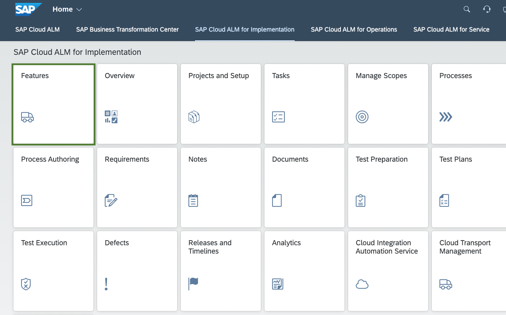
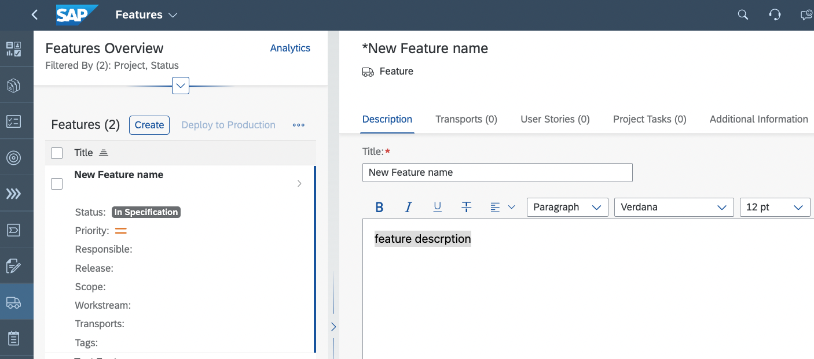
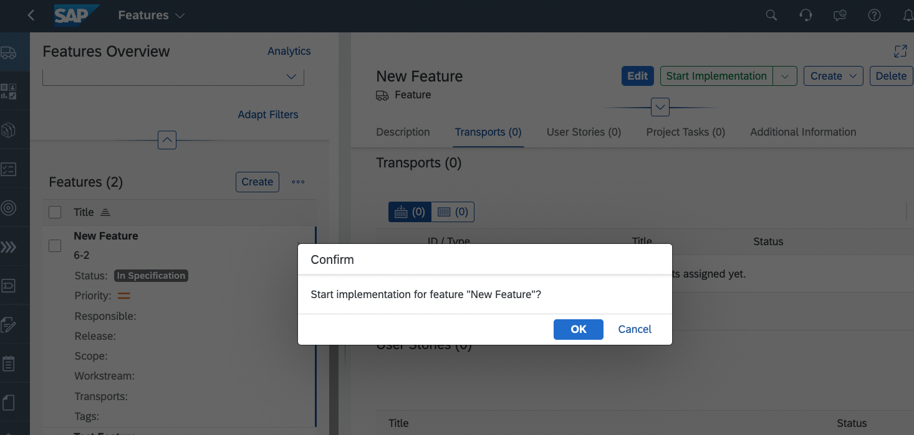

# Exercise 1 - Create SAP Cloud ALM Feature

In this exercise, we will create a new feature in SAP Cloud ALm tool. SAP Cloud ALM supports change management process by utilising features through deploy or changes throughout the landscape consistently. 

1.	Launch the Cloud ALM application [AD261-CALM] (https://ad261-calm-h7f2r9xc.eu10.alm.cloud.sap/launchpad#Shell-home) with your user <AD261-001@education.cloud.sap>. Navigate to Features.
Navigate to Features.
 

2.	Enter name based on user ID and description of feature. Save and Close. 
 

3. Start Implementation for newly created feature. 
 

## Summary

You've now created a new feature in Cloud ALM.

Continue to - [Exercise 2 - Export content using Content Agent service](../ex2/README.md)

