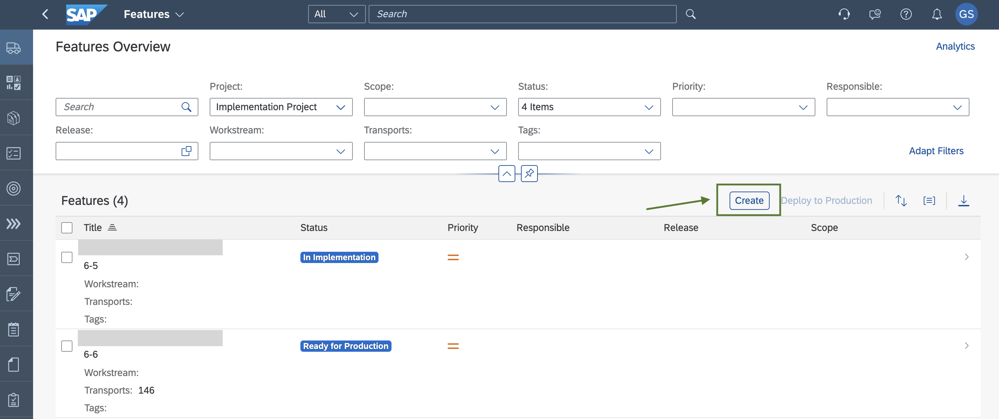

# Exercise 1 - Create a Feature in SAP Cloud ALM 

In this exercise, you will create a new feature in SAP Cloud ALM. SAP Cloud ALM supports change management processes by utilising features to document your changes and to orchestrate the deployment through your landscape. 

1. Launch the [Cloud ALM UI](https://ad261-calm-h7f2r9xc.eu10.alm.cloud.sap/launchpad#Shell-home) with your `AD261-<XXX>@education.cloud.sap` user.
2. Navigate to **Features**.  
    
3. Create a new feature by choosing **Create**.  
    
4. Enter the name as `Feature AD261-<XXX>`, for example `Feature AD261-001`.
5. Enter a suitable description of the feature, for example `Content Transport Feature For Teched Hands On`.
6. Save and close.  
    
7. Confirm that you want to start implementation for the new feature.  
    

## Summary

You've created a new feature in SAP Cloud ALM. 
Continue with [Exercise 2 - Export Content Using SAP Content Agent Service](../ex2/README.md).

