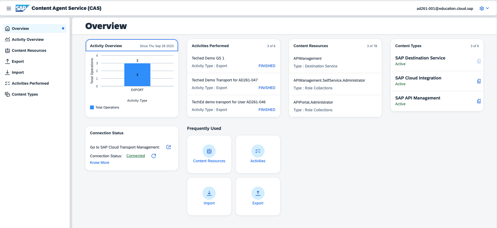
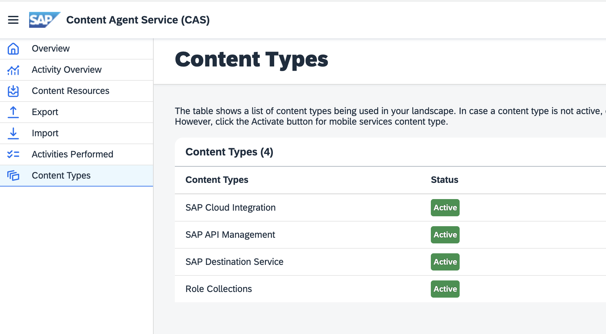
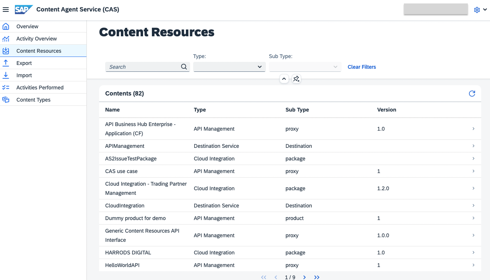
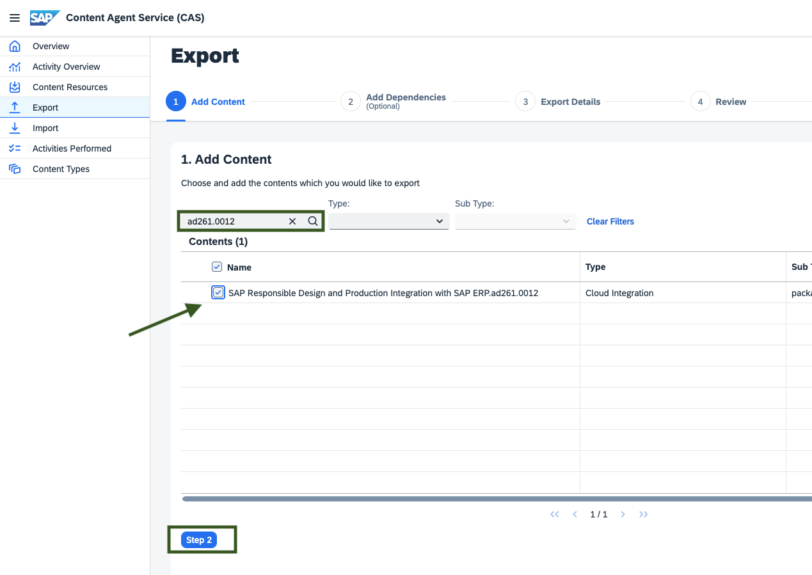
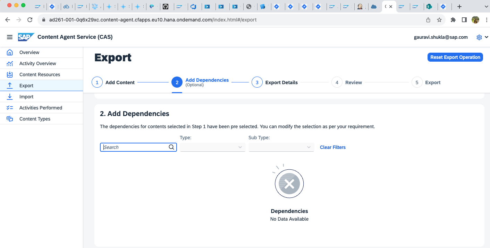
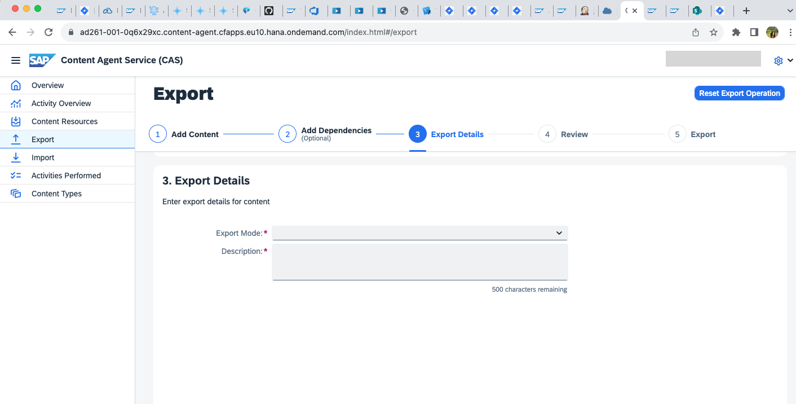
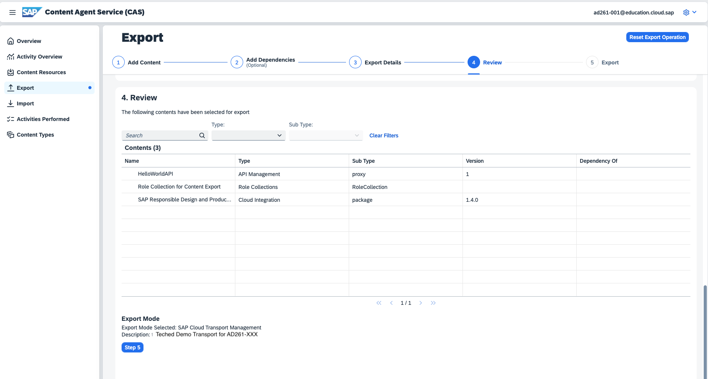
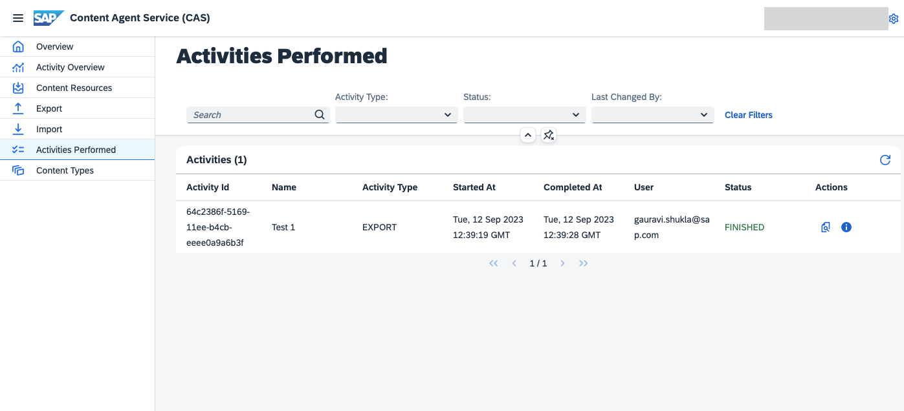
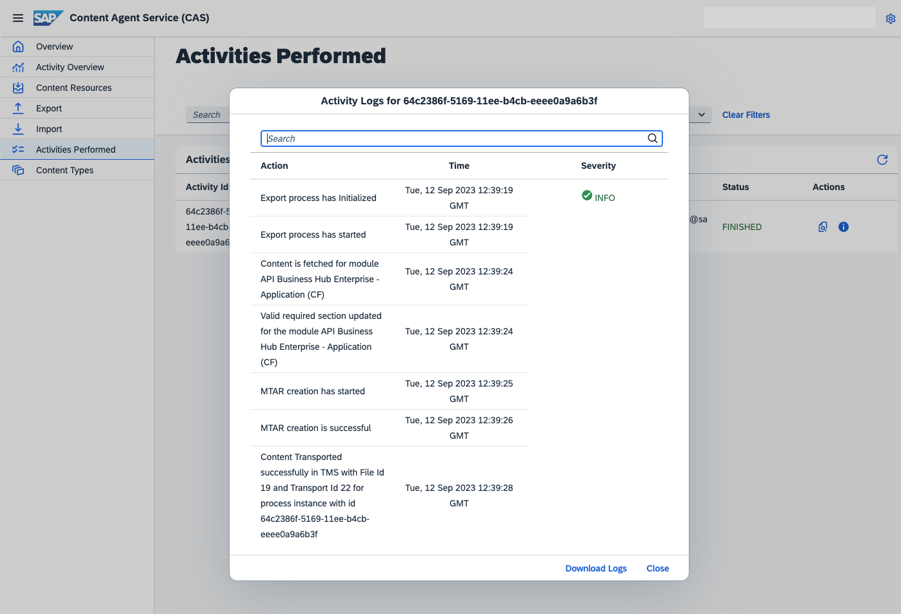
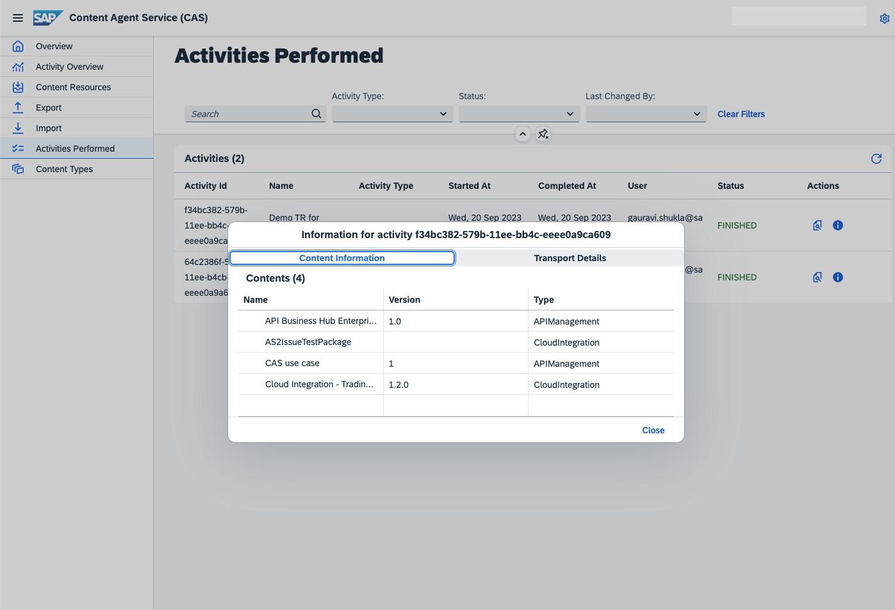

# Exercise 2 - Export Content using SAP Content Agent Service

Use the *SAP Content Agent* service to select the required content types from different SAP BTP applications. Choose the `SAP Cloud Transport Management` export mode to create a transport request to SAP Cloud Transport Management. 

1. Launch [Content Agent UI](https://ad261-001-0q6x29xc.content-agent.cfapps.eu10.hana.ondemand.com/) from your DEV account [AD261-001](https://emea.cockpit.btp.cloud.sap/cockpit/#/globalaccount/e2a835b0-3011-4c79-818a-d7767c4627cd/subaccount/6fd4e2f0-4751-4c32-a2c7-1f1591d4847e/subaccountoverview). The UI loads with the *Overview* page where you can view active content types and activities performed and available content resources.  
    

2. Go to the **Content Types** page and check the status of the available content types.  
    

3. Go to to **Content Resources** and explore the available content coming from across SAP BTP applications.
View the metadata and general information available for the different content resources.  
    

4. Start the export step by clicking on “Export” icon from left hand side menu.
Select multiple contents from different content types. You can use the filters for Content Type. After selection proceed to Step 2.
    | Content Type   | Content Name  |
	| -------------  | ------------- |
	| Cloud Integration   |SAP Responsible Design and Production Integration with SAP ERP.ad261.0012
	| SAP API Management  |  HelloWorldAPI  
	| Role Collection  |  Role Collection for Content Export | 
	
  

5. Since these content types do not have any dependencies, you observe an empty list. Skip this optional step to add dependencies and proceed to Step 3.
 

6.	Select Export Mode as “SAP Cloud Transport Management” and enter Description “Teched Demo Transport for AD261-XXX”. Proceed to Step 4.
for example “Teched  Demo Transport for AD261-001”. 
 

7. You would now be able to review all the choices you made about the content and transport. Proceed to Step 5. This would now start the export in the background and display logs and progress.
 

8. Navigate to the page from the menu in the left.
 

9. Check the logs for the last activity by clicking on Logs icon
 

10.	Check the content information and transport info by clicking on the info icon.
 

## Summary

You've now created a transport request with your user as suffix.
Continue to [Exercise 3 - Deploy to TEST using features in Cloud ALM ](../ex3/README.md)
