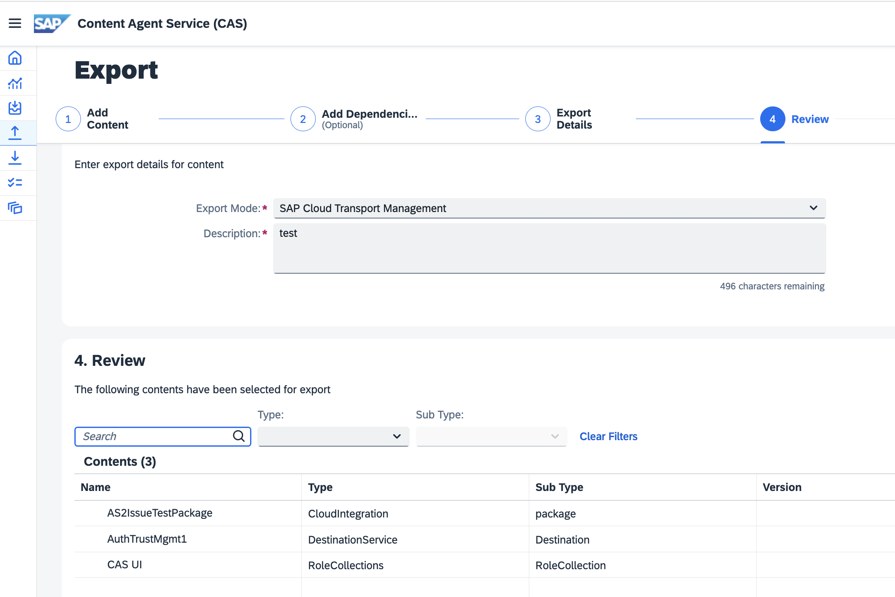

# Exercise 2 - Export content using Content Agent service

Use the standardized tool “Content Agent” to select desired contents across BTP application and export it using Cloud Transport Management service. The goal is to create a transport request using TMS. 

1. Launch [Content Agent UI](https://ad261-001-0q6x29xc.content-agent.cfapps.eu10.hana.ondemand.com/) from DEV account AD261-001.

2. Go To Content Types Page and check the status of Content Types.
 

3. Navigate To Content Resources and explore the available content coming from across SAP BTP applications.
View the metadata and general information available for different content resources. 
 

4. Start the export step by clicking on “Export” icon from left hand side menu.
Select multiple contents from different content types. You can use the filters for Content Type. After selection proceed to Step 2.
   <ul>
   * For Cloud Integration, search the integration package with your user .ad261.XXX and select it. For example, SAP Responsible Design and Production Integration with SAP ERP.ad261.0012
   * For SAP API Management, select "HelloWorldAPI"
   * For Role Collection, select "TBD"
   </ul>
  

5. Since these content types do not have any dependencies, you observe an empty list. Skip this optional step to add dependencies and proceed to Step 3.
 

6.	Select Export Mode as “SAP Cloud Transport Management” and enter Description “Teched  Demo Transport for <USER_NO>”
for example “Teched  Demo Transport for AD261-001”. 
 

7. Proceed to review step. 
 

8. Navigate to Activities Performed Page 
 

9.	Check the Logs and Info icon for the last activity
 

10.	Check the content Info and transport info
 

## Summary

You've now created a transport request with your user as suffix.

Continue to - [Exercise 3 - Deploy to TEST using features in Cloud ALM ](../ex3/README.md)
