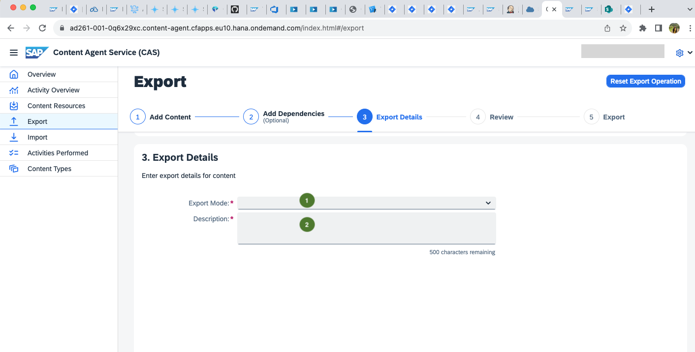

# Exercise 2 - Export Content Using SAP Content Agent Service

Use the **SAP Content Agent** service (CAS) to select the required content types from different SAP BTP applications, and export them in a format compatible with **SAP Cloud Transport Management** service (cTMS). The goal is to create a transport request that can be used with cTMS.

1. Launch the [Content Agent UI](https://ad261-001-0q6x29xc.content-agent.cfapps.eu10.hana.ondemand.com/) from your DEV account [AD261-001](https://emea.cockpit.btp.cloud.sap/cockpit/#/globalaccount/e2a835b0-3011-4c79-818a-d7767c4627cd/subaccount/6fd4e2f0-4751-4c32-a2c7-1f1591d4847e/subaccountoverview). The UI loads with the **Overview** page where you can view active content types, activities performed, and available content resources.  
    

2. Go to the **Content Types** page and check that the status of the available content types is **Active**. The **Active** status indicates that you can perform content operations for the content type in this account.  
    

3. Go to the **Content Resources** page and explore the available content coming from different SAP BTP applications.
View the metadata and the general information available for the different content resources.  
    

4. Go to the **Export** page to start the export. Select multiple contents from the different content types as shown in the following table. You can use filters for the content types. After selection, proceed to **Step 2**.
    | Content Type   | Content Name  |
	| -------------  | ------------- |
	| `Cloud Integration`   | `SAP Responsible Design and Production Integration with SAP ERP.ad261.0012`
	| `SAP API Management`  |  `HelloWorldAPI`  
	| `Role Collection`  |  `Role Collection for Content Export` |   
	

     

5. Since these content types do not have any dependencies, you observe an empty list. Skip this optional step to add dependencies and proceed to **Step 3**.
 

6. Select `SAP Cloud Transport Management` as the **Export Mode**, and enter `Teched Demo Transport for AD261-XXX` as the **Description**, for example `Teched  Demo Transport for AD261-001`. Afterwards, proceed to **Step 4**.  
    

7. Review all the choices you made about content and transport. To start the export in the background, proceed to **Step 5**.  
    

8. Go to the **Activities Performed** page to display logs and progress information.  
    

9. Check the logs for the last activity by clicking on the `Logs` icon.  
    

10. Check the content information and transport info by clicking on the `i (info)` icon.  
    

## Summary

You've created a transport request with your user as the suffix.
Continue with [Exercise 3 - Deploy to TEST Using Features in SAP Cloud ALM ](../ex3/README.md)
