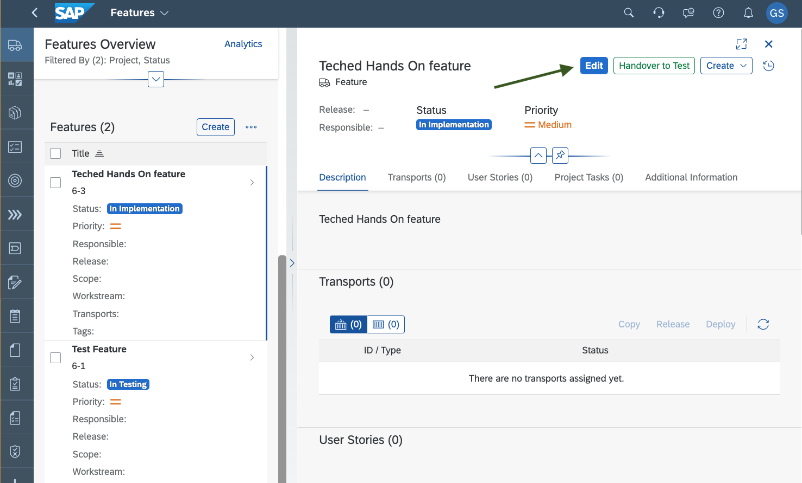
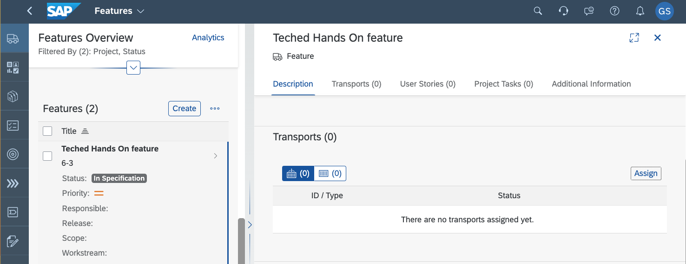
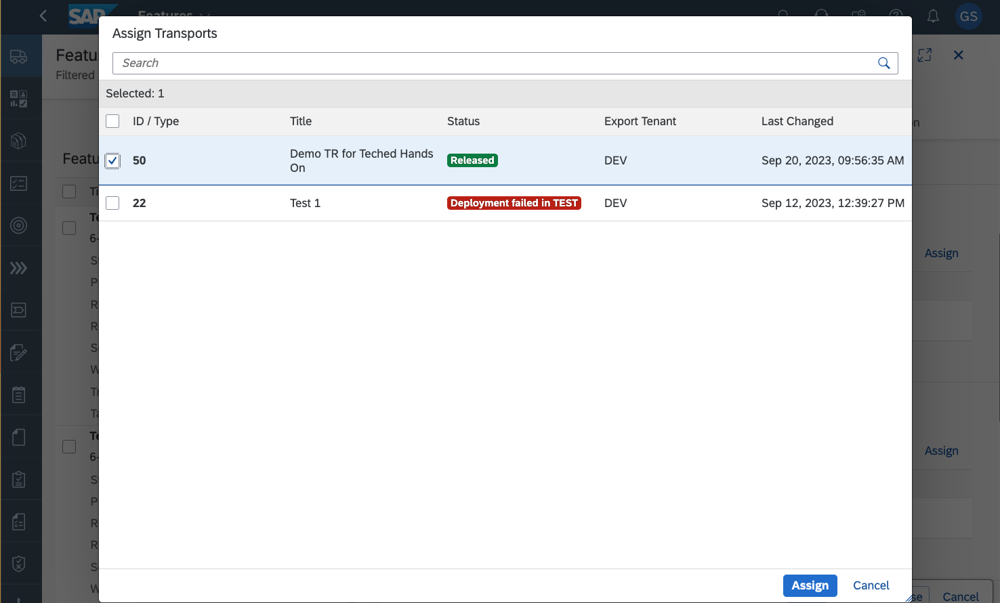
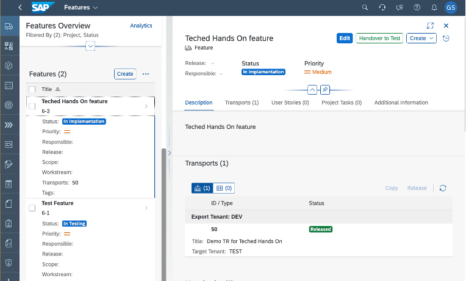
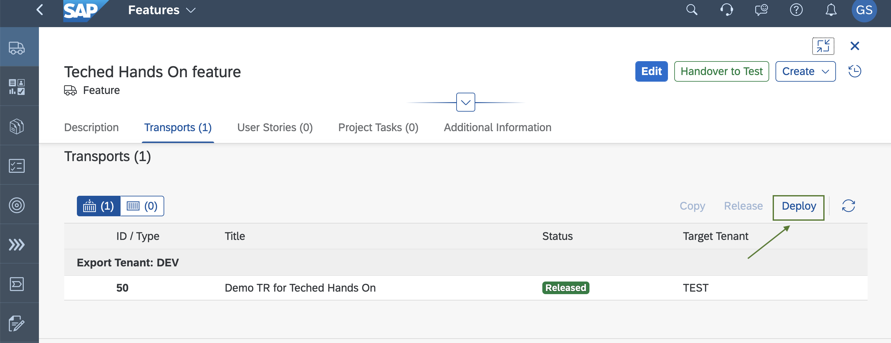
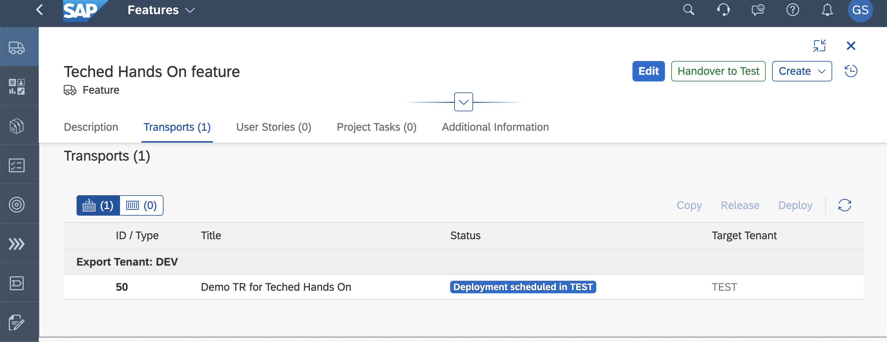
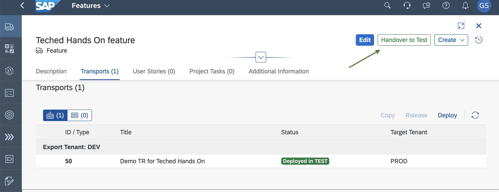
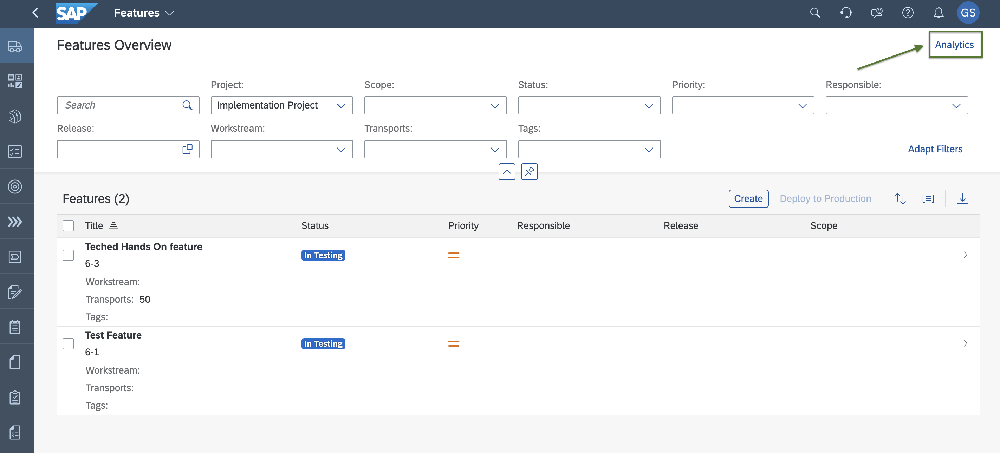
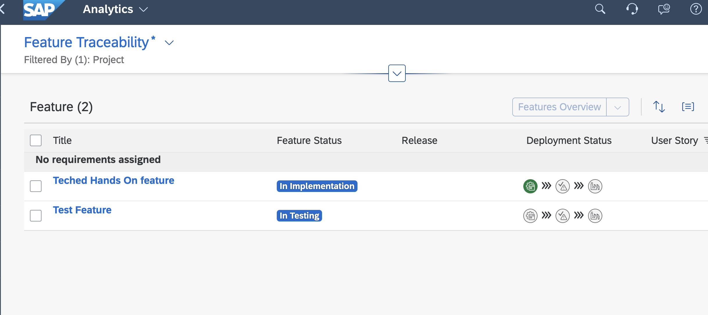

# Exercise 3 - Deploy to TEST Using the Features App in SAP Cloud ALM 

To use better traceability options with regards to changes pushed in the transport, feature can be used to track deployment status following change management policies of moving changes through pre-defined stages in auditable manner. The goal here is to assign the transport request in Cloud ALM and deploy content based on change workflow. 

1. Launch the [SAP Cloud ALM UI](https://ad261-calm-h7f2r9xc.eu10.alm.cloud.sap/).
2. Navigate to **Features**, and select the feature you created previously - `Feature AD261-XXX`.
3. Choose **Edit**.  
    

4. Under **Transports**, choose **Assign**. Choose the transport request with the description that contains your user as the suffix - `Teched Demo Transport for AD261-XXX`.   
    

5. Select the transport request you created - `Teched  Demo Transport for AD261-XXX` - and choose **Assign**.  
    

6. Save and close.  
    

7. To deploy the changes in the TEST tenant, choose **Deploy**.   
    
8. Check that the status of transport request `Teched  Demo Transport for AD261-XXX` changes to `Deployment scheduled in TEST`.   
    

9.	When the `Deployed in TEST` transport status is reached, change the deployment status from `Implementation` to `In Testing`. To do this,  choose **Handover to Test**.   
    

10.	Check the deployment status in the **Feature Traceability** app. To do this, navigate to `Features Overview` and select **Analytics**.    
    
11. Explore the different options and filters. End users can use this view to decide on which features they want to release to production.  
    

## Summary

You've deployed the changes in the TEST tenant where the different integration and acceptance tests can be performed. Continue with [Exercise 4 - Deploy to Production using SAP Cloud Transport Management](../ex4/README.md)
