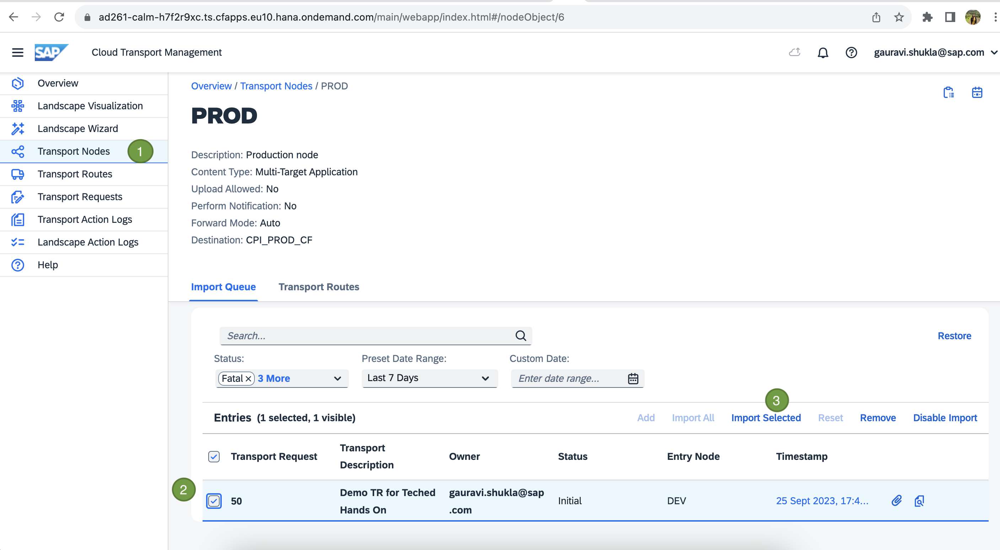
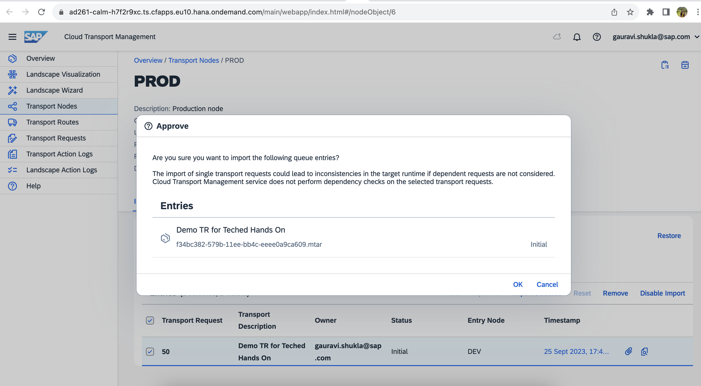
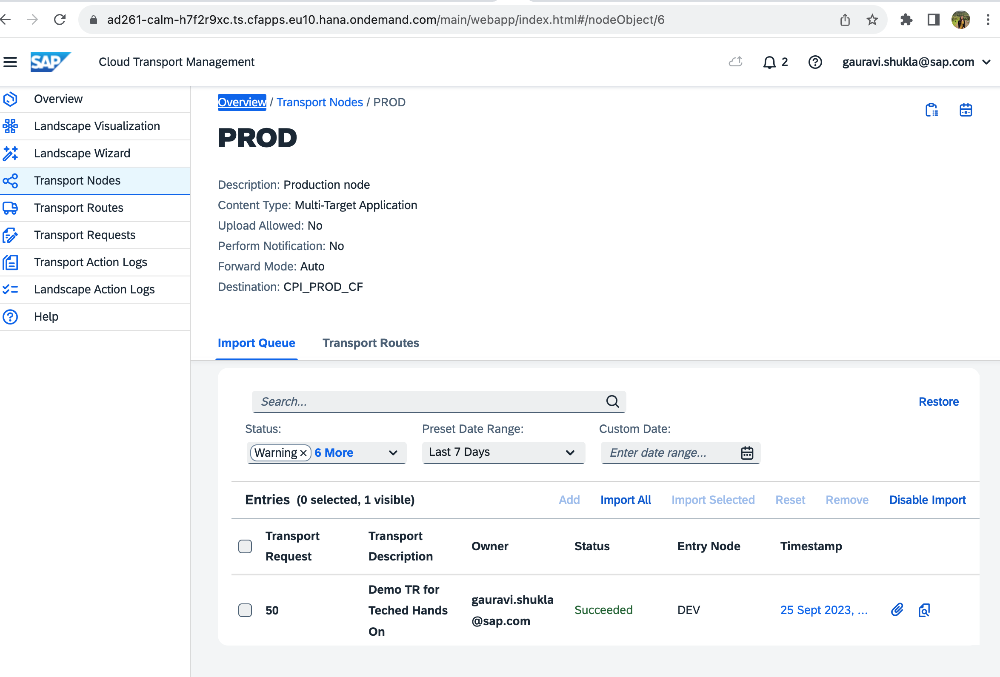

# Exercise 4 - Deploy to Production using Cloud Transport Management 

Triggers Import in Cloud Transport Management by selecting the transport request from production node.

1. Navigate to the [TMS UI](https://ad261-calm-h7f2r9xc.ts.cfapps.eu10.hana.ondemand.com/main/webapp/index.html#/nodeObject/6) and select the PROD from Transport Nodes. Select the Transport request with your user suffix and click on Import Selected.
 
 
 

2.	Navigate to Cloud ALM and Confirm Deployment for the desired Feature
 
 
 

3. Show History in Cloud ALM. 
 
 

## Summary

You've now deployed the changes to TEST system.

Continue to - [Exercise 4 - Excercise 3 ](../ex4/README.md)
