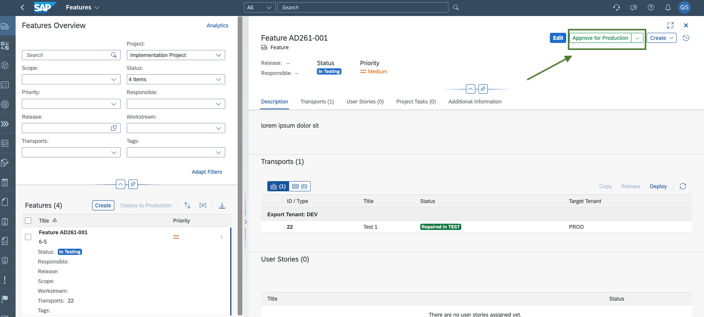
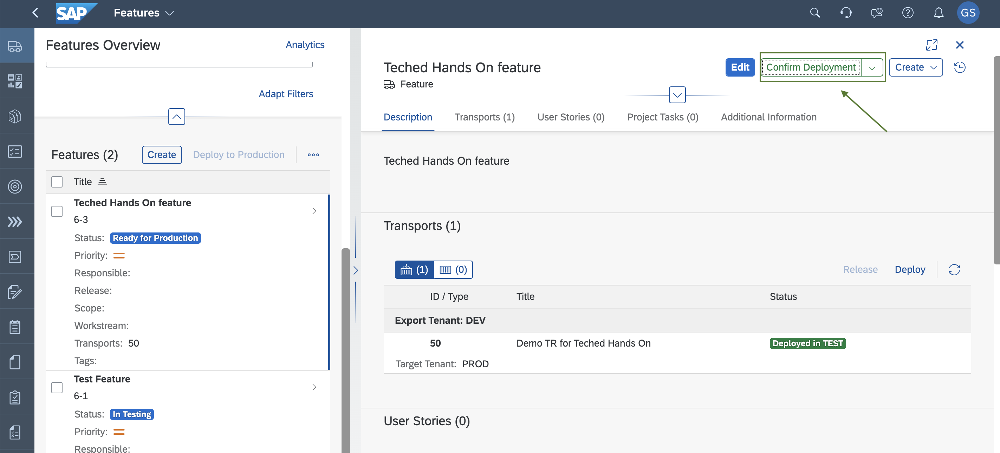
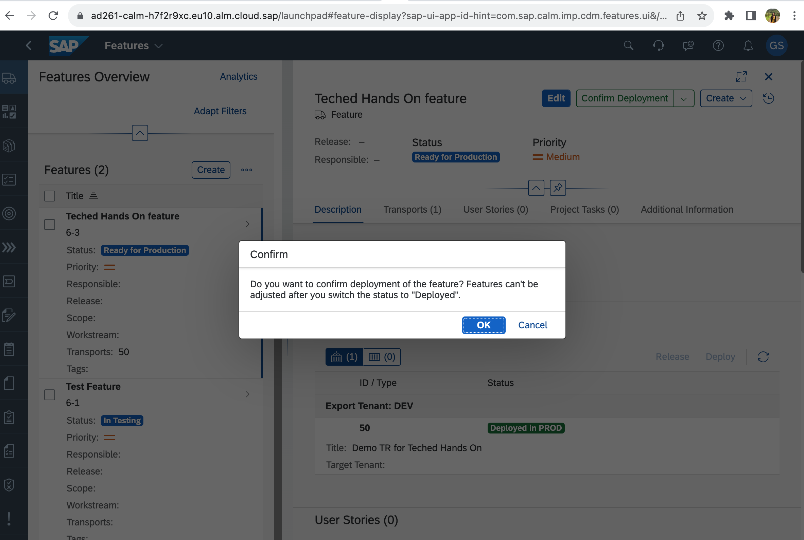
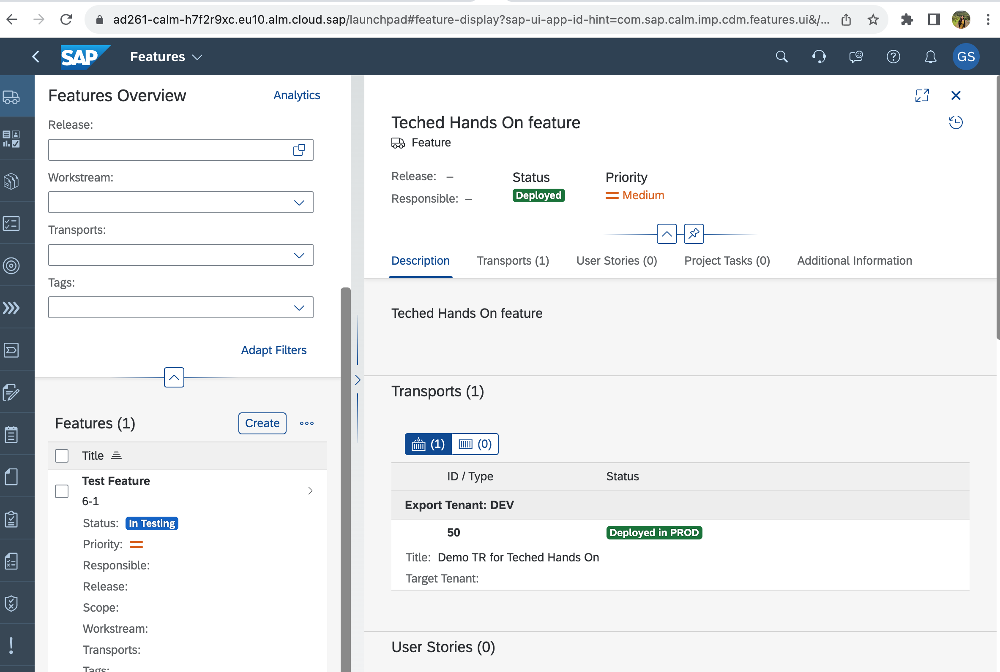
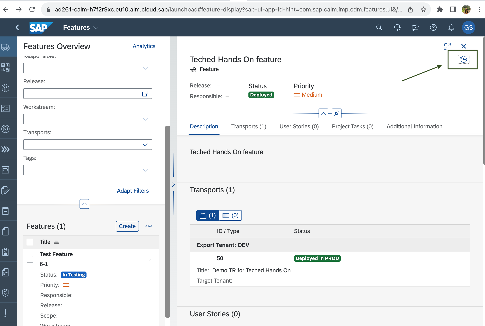
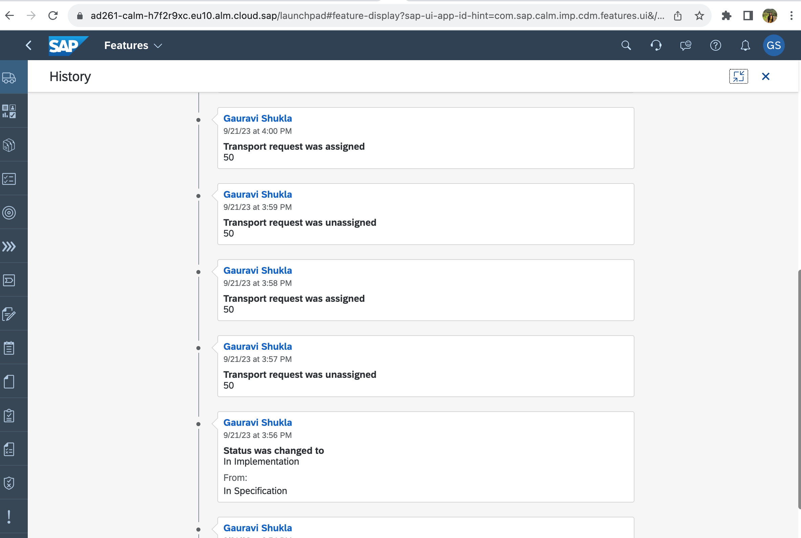

# Exercise 4 - Deploy to Production 

Once the changes are successfully tested in the TEST tenant, start the deployment process for the PROD tenant.
1. In [SAP Cloud ALM UI](https://ad261-calm-h7f2r9xc.eu10.alm.cloud.sap/launchpad#Shell-home),
select the feature **Feature AD261-XXX** and choose **Approve for Production**.  
    

2. After approving the feature for deployment, click on **Deploy** to start production deployment.
When you observe a final confirmation, click **OK**.  After confirming, the deployment gets scheduled and takes a few minutes to complete.  
      
      
      

3. Check the history by clicking on the clock icon in the feature detail page. 
      
      

## Summary

You've deployed the changes to the PROD system. In the next steps, you will verify the logs and the content availability.  

Continue with - [Exercise 5 - Confirm Production Deployment](../ex5/README.md)
