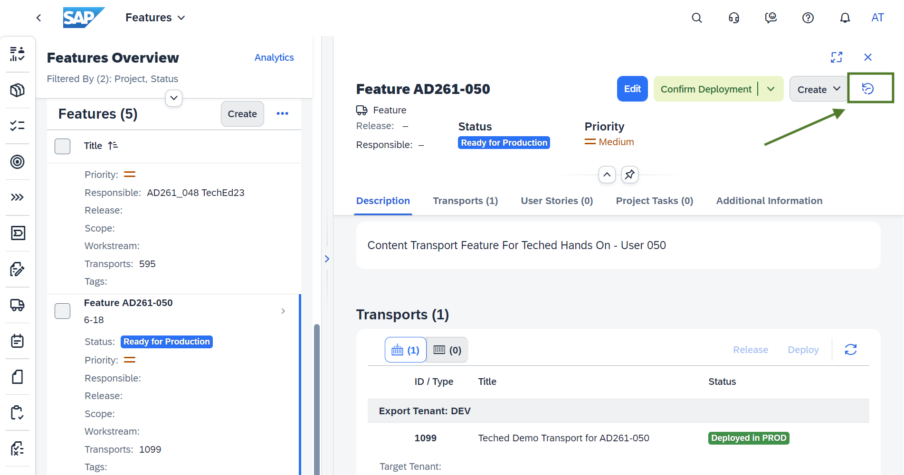

# Exercise 4 - Deploy to Production 

Once the changes are successfully tested in TEST tenant, start the deployment process for PROD tenant.
1. In [Cloud ALM UI](https://ad261-calm-h7f2r9xc.eu10.alm.cloud.sap/launchpad#Shell-home),
select the feature "Feature AD261-XXX" and click on "Approve for Production"
 

2. After approving the feature for deployment, click on Deploy to start production deployment.
 You observe a final confirmation, click OK.
 After confirming the deployment gets scheduled and takes a few minutes to complete. 
 
 
 

3. Check the history by clicking on the clock icon in the feature detail page. 
 
 

## Summary

You've now deployed the changes to PROD system. Next step would be to verify logs and content availability 

Continue to - [Exercise 5 - View deployed content in Prod account](../ex5/README.md)
