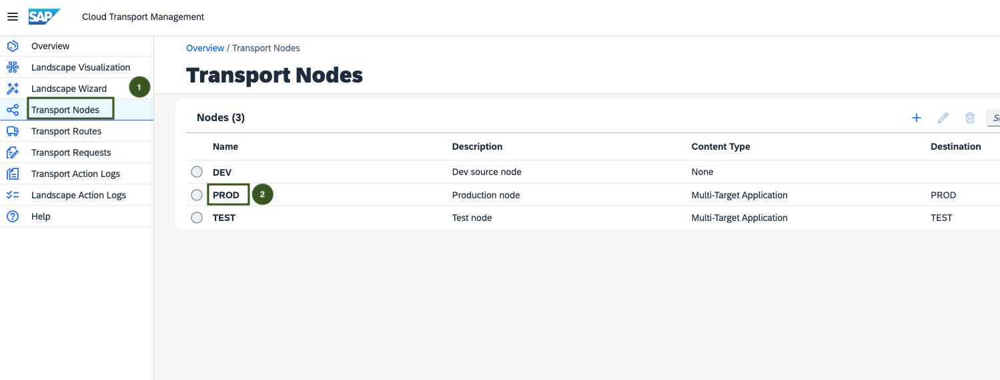
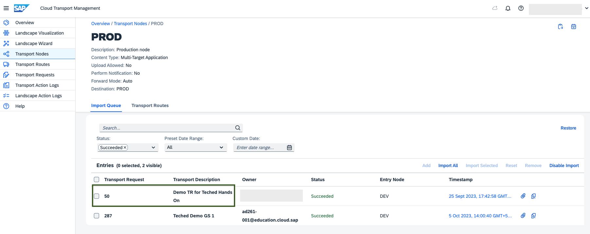
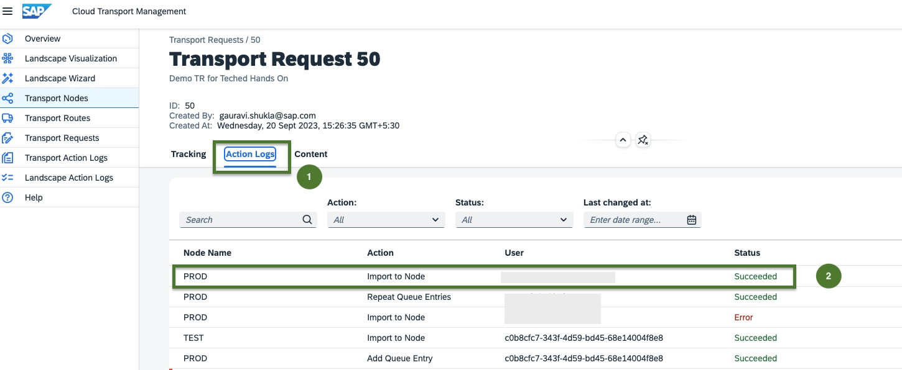
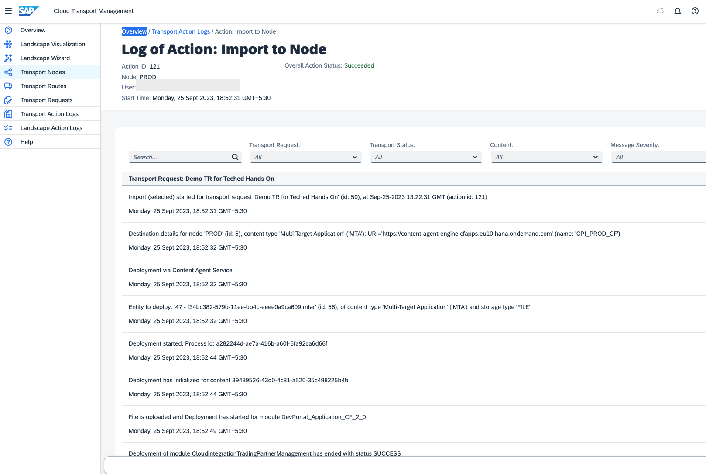
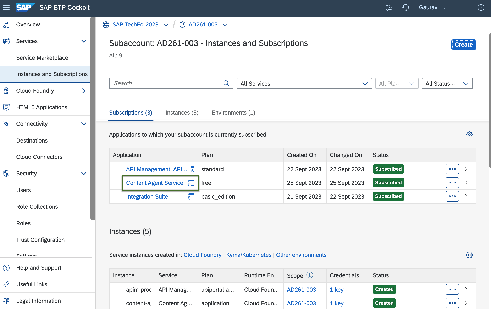
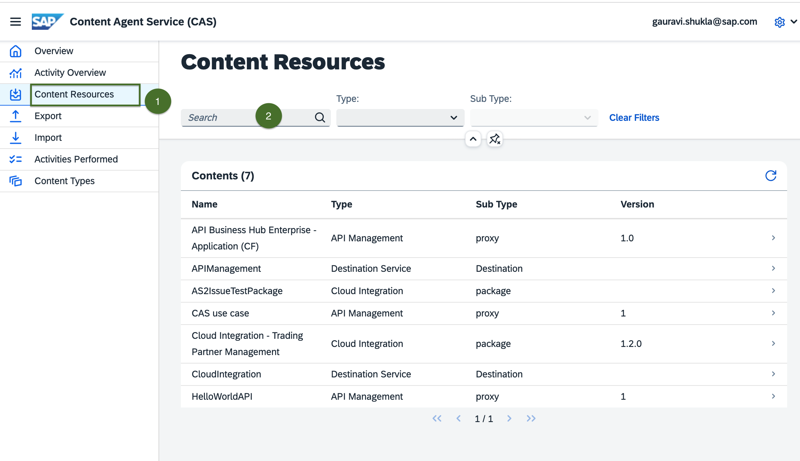
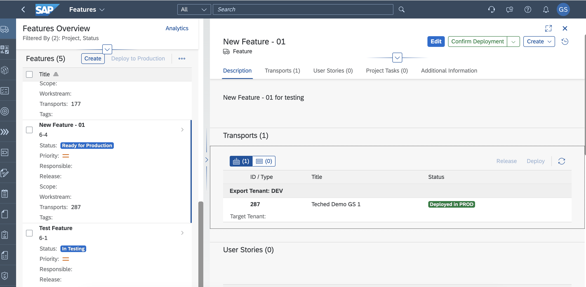
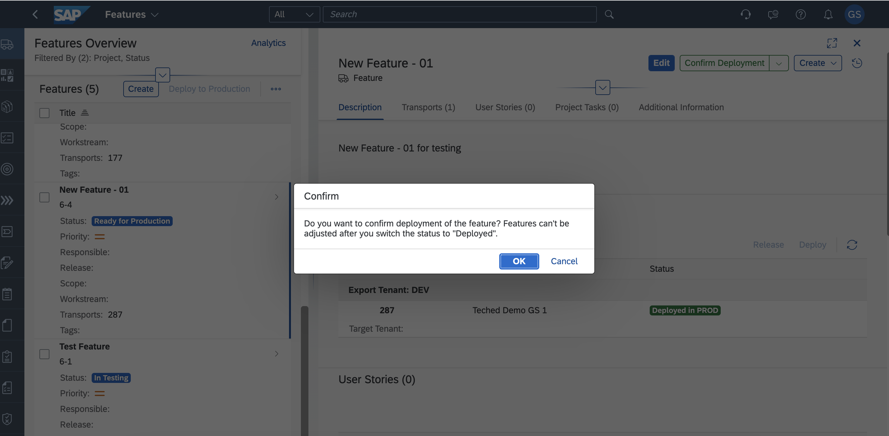

# Exercise 5 - Check transport action logs and view the deployed content

 
</b>First step is to check the action logs in the Cloud Transport Management service UI. 

1. Navigate to [TMS UI](https://ad261-calm-h7f2r9xc.ts.cfapps.eu10.hana.ondemand.com/main/webapp/index.html#/nodeObject/6) and select the PROD from Transport Nodes. 
   Click on Transport Nodes from left hand side menu and select target node "PROD".
    

2. Search for the transport request your user suffix "Teched  Demo Transport for AD261-XXX" and click on Import Selected.
 

3. Check the status of Import for target node "PROD" by clicking on "Action Logs"
 
 

 
</b> Once the action logs are validated you can also chose to validate the content availability in the PROD tenant.
 

1. Launch the [Content Agent UI](https://ad261-003-020ez9xc.content-agent.cfapps.eu10.hana.ondemand.com/) from the PROD account.
 

2. Navigate to Content Resources and search for the integration Package with your user as suffix. For Cloud Integration, search the integration package with your user .ad261.XXX. 
For example, SAP Responsible Design and Production Integration with SAP ERP.ad261.0012.
 

 
</b> Confirm Feature in Cloud ALM
 

1. Navigate to Cloud ALM UI(https://ad261-calm-h7f2r9xc.eu10.alm.cloud.sap/launchpad#Shell-home). Select the feature "Feature AD261-XXX" and click on "Confirm Deployment".
 
 

## Summary
You've now successfully validated the changes to PROD system. You have confirmed the deployment in ALM feature
