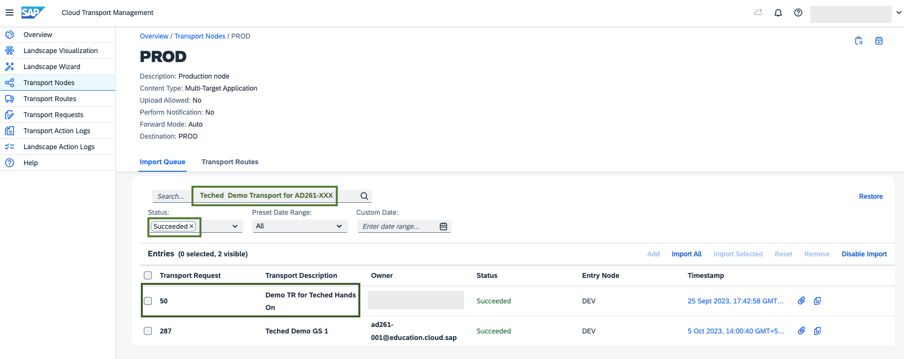

# Exercise 5 - Confirm Production Deployment
Check the action logs in the Cloud Transport Management service UI. 

1. Launch the [cTMS UI](https://ad261-calm-h7f2r9xc.ts.cfapps.eu10.hana.ondemand.com/main/webapp/index.html#/nodeObject/6).
2. Go to **Transport Nodes** and select the `PROD` node.  
    

3. Click on the transport request with your user suffix `Teched  Demo Transport for AD261-XXX`.   
    

4. Check the status of the import for target node PROD by clicking on **Action Logs**.  
    
5. To get a detailed log of the **Import to Node** action, click anywhere in the row.  
    

After checking the action logs, you can also chose to validate the content availability in the PROD tenant.

1. Launch the [Content Agent UI](https://ad261-003-020ez9xc.content-agent.cfapps.eu10.hana.ondemand.com/) from the PROD account.  
    

2. Navigate to **Content Resources** and search for the integration package with your user as suffix. For Cloud Integration, search for the integration package with your user `.ad261.XXX`. 
For example, `SAP Responsible Design and Production Integration with SAP ERP.ad261.0012`.  
    

Confirm the Feature in SAP Cloud ALM

1. Launch [SAP Cloud ALM UI](https://ad261-calm-h7f2r9xc.eu10.alm.cloud.sap/launchpad#Shell-home).
2. Select the feature - `Feature AD261-XXX` and choose **Confirm Deployment**.  
    
3. Confirm the deployment of your feature.  
    

## Summary
You've now successfully validated the changes to PROD system. You have confirmed the deployment in SAP Cloud ALM feature.
